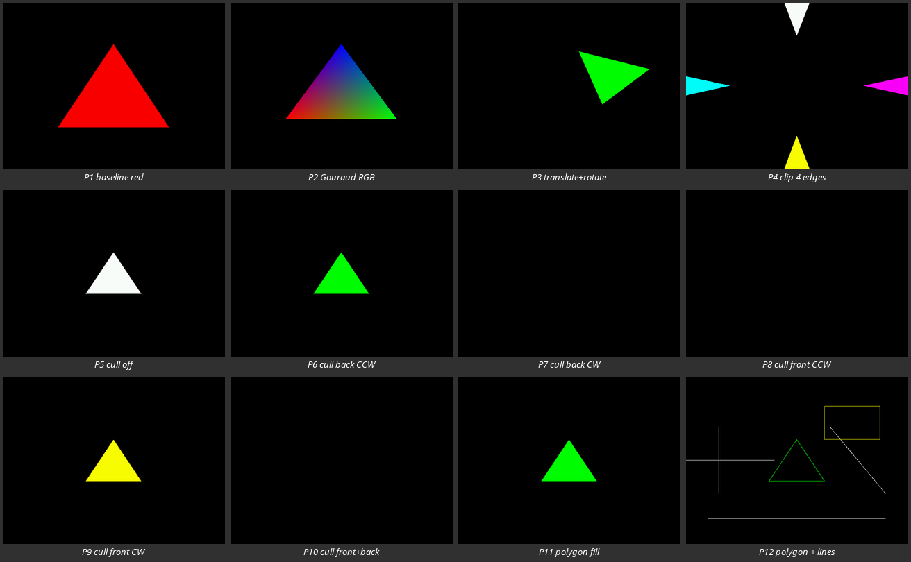
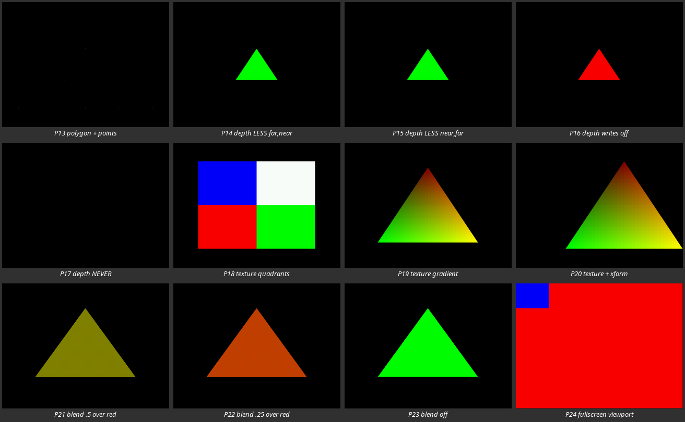

# TinyGL for Dreamcast

This is a fork of [TinyGL](https://github.com/ska80/tinygl) (Fabrice Bellard's
small OpenGL subset, MIT licensed) with a **Dreamcast PVR backend**. The
`dreamcast` branch keeps TinyGL's software renderer and public API, and adds a
path that transforms and clips on the SH4, then submits triangles straight to
the PVR through [KallistiOS](https://github.com/KallistiOS/KallistiOS).

The `master` branch mirrors upstream. All Dreamcast work lives here.

> **Hardware is the source of truth.** Everything marked "tested" in
> [`TESTING.md`](TESTING.md) was run on a real Dreamcast. Emulators (Flycast and
> friends) can hide alignment, cache, and PVR-flag bugs, so don't treat an
> emulator pass as acceptance.

The original upstream README, covering the software renderer, GLX, and the
X11 examples, is kept as [`README`](README).

## Requirements

- A working KallistiOS toolchain (developed against KOS 2.3.0).
- Optional: the `sh4zam` kos-port, for SH4 math and memory copies. The normal
  build does not depend on it.

## Building the library

```bash
source /opt/toolchains/dc/kos/environ.sh     # adjust to your KOS install
make -C src clean
make -C src CC=kos-cc TINYGL_USE_GLX= TINYGL_USE_DREAMCAST_PVR=y
```

Add `TINYGL_USE_SH4ZAM=y` to use SH4ZAM. This produces `src/libTinyGL.a`.

| Variable | Effect |
|---|---|
| `TINYGL_USE_DREAMCAST_PVR=y` | Build the PVR backend (`src/pvr_dc.c`). |
| `TINYGL_USE_SH4ZAM=y` | Use SH4ZAM math/copy routines. Needs the port installed. |
| `TINYGL_USE_GLX=` (empty) | Turn off the X11/GLX layer, which you don't want on Dreamcast. |

`TINYGL_PROFILE_STAGES` and `TINYGL_PROFILE_PVR` enable per-stage and
per-frame profiling counters (see `include/GL/tglprofile.h`). They're off by
default.

## Using it in your program

TinyGL never sets the video mode. Your program does, through KOS, and then
tells `glInitPVR` the same size. KOS's default (640x480) works without any
call, which is what `nehe06` relies on. Other modes need `vid_set_mode()`
first, as `pvr_smoke` does:

```c
#include <kos.h>
#include <GL/gl.h>

int main(void) {
    vid_set_mode(DM_640x480, PM_RGB565);   /* optional at the KOS default */

    if (glInitPVR(640, 480) < 0)       /* brings up KOS PVR */
        return 1;

    /* normal TinyGL/GL calls: glMatrixMode, glVertex3f, glBindTexture, ... */

    for (;;) {
        glClear(GL_COLOR_BUFFER_BIT | GL_DEPTH_BUFFER_BIT);
        /* draw the scene */
        glFlush();                      /* submits the frame to the PVR */
    }

    glClose();                          /* shuts PVR down */
    return 0;
}
```

There's no application-managed buffer swap: `glFlush()` ends the PVR scene and
renders it. Link against `src/libTinyGL.a` with `-I include`, as the test
Makefiles do.

Video modes `320x240`, `640x480`, and `768x480` are hardware-tested.
`768x576` (PAL) is still untested on PAL hardware.

## Examples and tests

These live in `tests/dreamcast/`. Each has its own Makefile and links
`../../../src/libTinyGL.a`, so build the library first.

| Directory | What it is |
|---|---|
| `nehe06/` | Textured rotating cube (a NeHe lesson 06 port, with a romdisk texture). The best "hello world". |
| `pvr_smoke/` | Hardware self-test. Runs 24 labeled phases (Gouraud, transforms, clipping, culling, polygon modes, depth, textures, blending, lines/points, video modes) and prints `pvr_smoke: PASS`. |
| `tinyballs/` | Rotating lit spheres. Stresses transforms, normals, and `GL_NORMALIZE`, for SH4ZAM on/off comparisons. |
| `pvrmark_strips/` | Triangle-strip throughput benchmark, in the style of GLdc's `pvrmark_strips`. |
| `pvrmark_strips_tex/` | The same benchmark with a bound texture. |
| `strip_lit_probe/` | Diagnostic for lit triangle strips. Not a demo. |

Build and run one over the network with KOS's `kos-tool`:

```bash
make -C tests/dreamcast/nehe06
export DC_IP=192.168.0.128                      # your console's address
kos-tool -m /tmp -t "$DC_IP" -x tests/dreamcast/nehe06/tinygl-nehe06.elf
```

The smoke test also writes PPM screenshots of each phase to the host through
`-m /tmp`. See [`TESTING.md`](TESTING.md) for exact build lines, expected
output, and recorded hardware results.

The X11 programs in `examples/` are upstream's and don't build for Dreamcast.

### `nehe06` demo
https://github.com/user-attachments/assets/ee74a0ba-0a07-4463-a8be-817ccb256c5d


A NeHe lesson 06 textured cube, running through TinyGL's PVR backend. The
clip above was recorded in Flycast because that's the easiest way to capture
video. The same build has also been run on a real Dreamcast and looks the
same there.

## What `pvr_smoke` checks (real hardware captures)

`pvr_smoke` draws 24 labeled phases of 150 frames each through the normal
TinyGL calls, takes a screenshot at the end of each phase, and prints
`pvr_smoke: PASS` if every frame submitted cleanly. The images below are
those captures from a real Dreamcast (KOS 2.3.0, 640x480 VGA, SH4ZAM on),
scaled down to thumbnails. Black frames are deliberate: they prove a
culled or rejected primitive really was dropped.



| Phase | What it tests |
|---|---|
| P1 baseline red | Scene begin/flush, background clear, one flat-colored triangle. |
| P2 Gouraud RGB | Per-vertex colors interpolated across a triangle. |
| P3 translate+rotate | The modelview matrix is applied before submission. |
| P4 clip 4 edges | Triangles crossing each screen edge are clipped to the view volume. |
| P5 cull off | `glDisable(GL_CULL_FACE)` draws the triangle. |
| P6 cull back CCW | Back-face culling keeps a counter-clockwise (front) face. |
| P7 cull back CW | Back-face culling drops a clockwise (back) face. Frame stays black. |
| P8 cull front CCW | Front-face culling drops a front face. Frame stays black. |
| P9 cull front CW | Front-face culling keeps a back face. |
| P10 cull front+back | `GL_FRONT_AND_BACK` culls both windings. Frame stays black. |
| P11 polygon fill | `glPolygonMode(GL_FRONT_AND_BACK, GL_FILL)`. |
| P12 polygon + lines | `GL_LINE` polygon mode (the triangle outline) plus direct `GL_LINES`: a cross, a clipped rectangle, a diagonal, and a baseline, all emitted as PVR strips. |



| Phase | What it tests |
|---|---|
| P13 polygon + points | `GL_POINT` polygon mode and direct points. They're one pixel each, so they're tiny in the thumbnail. |
| P14 depth LESS far,near | Depth test: a near green triangle drawn after a far red one wins. |
| P15 depth LESS near,far | The same result with the draw order reversed, so it doesn't depend on submission order. |
| P16 depth writes off | `glDepthMask(GL_FALSE)`: the later far red triangle overwrites the near one. |
| P17 depth NEVER | `GL_NEVER` rejects every fragment. Frame stays black. |
| P18 texture quadrants | RGB565 texture upload (twiddled via KOS) and orientation: four colored quadrants in the right places. |
| P19 texture gradient | Texture coordinates interpolated across a triangle. |
| P20 texture + xform | The same gradient texture under a transform. |
| P21 blend .5 over red | `SRC_ALPHA / ONE_MINUS_SRC_ALPHA` at 50% alpha (olive). |
| P22 blend .25 over red | The same blend at 25% alpha (orange-red). |
| P23 blend off | Blending disabled gives an opaque green triangle. |
| P24 fullscreen viewport | A full-screen polygon plus a reference square at about 20% of the width, so you can check the viewport at any resolution. |

These are visual checks against what each phase should show. Pixel counts
and per-phase notes from earlier runs are in [`TESTING.md`](TESTING.md).

## Status

**Hardware-confirmed:** triangles with Gouraud color, depth, culling and polygon
modes, clipping, RGB565 textures, `SRC_ALPHA / ONE_MINUS_SRC_ALPHA` blending,
points and lines (emitted as PVR strips), native PVR triangle strips for
unlit `GL_TRIANGLE_STRIP`, and submission-error reporting and recovery.

**Known gaps:**

- Lit triangle strips fall back to the per-triangle path.
- Unsupported blend factors fall back to a source-only factor. Non-`ADD` blend
  equations and `GL_BLEND_COLOR` aren't handled.
- `glPointSize` and `glLineWidth` aren't part of TinyGL's API.
- Video modes beyond the ones above are untested on hardware.

Details and the roadmap are in [`NEXT_TASKS.md`](NEXT_TASKS.md). For the
software renderer's function coverage, see [`LIMITATIONS`](LIMITATIONS).

## Documentation map

| File | Contents |
|---|---|
| [`TESTING.md`](TESTING.md) | Build and run procedures, plus observed hardware results. |
| [`NEXT_TASKS.md`](NEXT_TASKS.md) | Milestones, known gaps, and what's next. |
| [`docs/`](docs) | Reference notes, including how other Dreamcast GL backends compare. |
| [`AGENTS.md`](AGENTS.md) | Project goals and implementation preferences. |

## License

MIT, same as upstream. See [`LICENSE`](LICENSE). TinyGL is
© 1997-2002 Fabrice Bellard. The Dreamcast backend is by Troy Davis.
